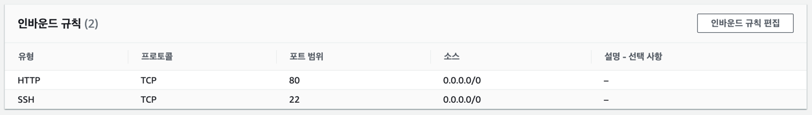
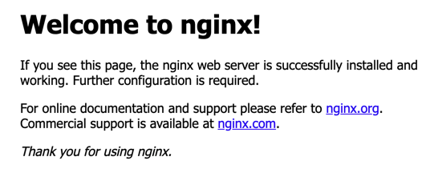

AWS 서버 접속
1. chmod 400 keypair.pem (keypair.pem은 tool에 저장되어 있음)

2. ssh -i "keypair.pem" ubuntu@ec2-54-180-127-142.ap-northeast-2.compute.amazonaws.com

위 과정 거쳐서 내가 만든 우분투 서버에 접속할 수 있었다.

> ###우분투 최신버전으로 업데이트
> 
> $ sudo apt-get update

> ### nginx(엔진엑스) 설치
> 
> 엔진엑스는 동시접 처리에 특화된 웹 서버 프로그램이다.
> Apache(아파치)보다 동작이 단순하고, 전달자 역할만 하기 때문에 동시 접속 처리에 특화되어 있다.
> 
> $ sudo apt-get install nginx

> ### 서버 상태 확인
> 
> $ sudo service nginx status

> ### 인바운드 규칙 추가
> 
> 외부에서 내 서버에 무언가를 요청하는 것
>
> 

> ### 서버에 접속 (TEST)
> 
> 퍼블릭 IPv4 주소로 접속했을 때, Welcome to nginx! 문구가 뜨면 성공. 
> 
> 

> ### 서버에 파일 업로드 할 수 있게 권한 설정
> index.html 경로 : /var/www/html
> 
> $ sudo chmod 777 -R html/

> ### 서버와 리모트 연결 (SFTP)
> 로컬에서 추가한 파일이 서버에 자동으로 업로드 되게 하기 위해 필요한 부분