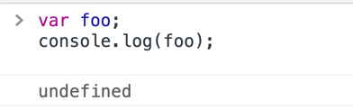

## 데이터 타입과 변수

- 변수는 값의 위치(주소)를 기억하는 저장소이다.

- 값의 위치란 값이 위치하고 있는 메모리 상의 주소를 의미한다.

- 즉, 변수란 값이 위치하고 있는 메모리 주소에 접근하기 위해 사람이 이해할 수 있는 언어로 명명한 __식별자__ 이다.

- 메모리에 값을 저장하기 위해서는 먼저 메모리 공간을 확보해야 할 메모리의 크기(byte)를 알아야 한다.

    - 이는 값의 종류에 따라 확보해야 할 메모리의 크기가 다르기 때문이다.
    
    - 이때 값의 종류, 즉 데이터의 종류를 데이터 타입이라 한다.
    
- 자바스크립트는 동적 타입언어이다.

    - 변수의 타입지정 없이 값이 할당되는 과정에서 자동으로 변수의 타입이 결정된다.
  

### 1. 데이터 타입

- 데이터 타입은 한정된 메모리 공간을 효율적으로 사용하기 위해서, 그리고 2진수 데이터로 메모리에 저장된

  데이터로 메모리에 저장된 데이터를 다양한 형태로 사용하기 위해 존재한다.

- ES6 기준으로 7개의 데이터 타입을 제공한다.

- 원시 타입(primitive data type)

  - boolean
  
  - null
  
  - undefined
  
  - number
  
  - string
  
  - symbol
  
- 객체 타입 (object/reference type)

  - object
  
#### 1.1.1 number

- 2진수, 8진수, 16진수 리터럴은 메모리에 동일한 배정밀도 64비트 부동소수점 형식의 2진수로 저장된다.

- 자바스크립트는 2진수, 8진수, 16진수 데이터 타입을 제공하지 않기 때문에 이들 값을 참조하면 모두 10진수로 해석된다.

 

- 자바스크립트의 숫자 타입은 정수만을 위한 타입이 없고 모든 수를 실수로 처리한다.

 

#### 1.1.2 string

- C와 같은 언어와 다르게, 자바스크립트의 문자열은 원시 타입이며 변경 불가능하다.

- 첫번째 구문이 실행되면 메모리에 'Hello'가 생성되고 식별자 str은 'Hello'의 메모리 주소를 가리킨다.

- 두번째 구문이 실행되면 이전 생성된 문자열 'Hello'을 수정하는 것이 아닌 새로운 문자열 'world'를 메모리에 생성한다.

  str은 이것을 가리킨다,

- 이때 문자열 'Hello', 'world' 모두 메모리에 존재하고 있다.

- 새로운 문자열을 재할당하는 것은 물론 가능하다.

- 이는 기존 문자열을 변경하는 것이 아니라 새로운 문자열을 새롭게 할당하는 것이기 때문이다.

 

#### 1.1.3 boolean

- 불리언(boolean) 타입의 값은 논리적 참, 거짓을 나타내는 true와 false뿐이다.

 

#### 1.1.4 undefined

