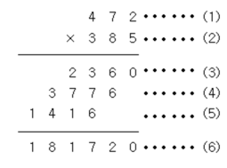

### 문제

(세 자리 수) × (세 자리 수)는 다음과 같은 과정을 통하여 이루어진다.

(1)과 (2)위치에 들어갈 세 자리 자연수가 주어질 때 (3), (4), (5), (6)위치에 들어갈 값을 구하는 프로그램을 작성하시오.

### 입력

첫째 줄에 (1)의 위치에 들어갈 세 자리 자연수가, 둘째 줄에 (2)의 위치에 들어갈 세자리 자연수가 주어진다.

### 출력

첫째 줄부터 넷째 줄까지 차례대로 (3), (4), (5), (6)에 들어갈 값을 출력한다.

~~~ Java
import java.util.Scanner;

public class Main {
    public static void main(String[] args) {
        Scanner scanner = new Scanner(System.in);

        int a = scanner.nextInt();
        int b = scanner.nextInt();

        int firstCalc = a * (b%10);
        int secondCalc = a * ((b%100) / 10 );
        int thirdCalc = a * (b/100);
        int calcResult = firstCalc + ( secondCalc * 10 ) + ( thirdCalc * 100 );

        System.out.println( firstCalc );
        System.out.println( secondCalc );
        System.out.println( thirdCalc );
        System.out.println( calcResult );
    }
}
~~~